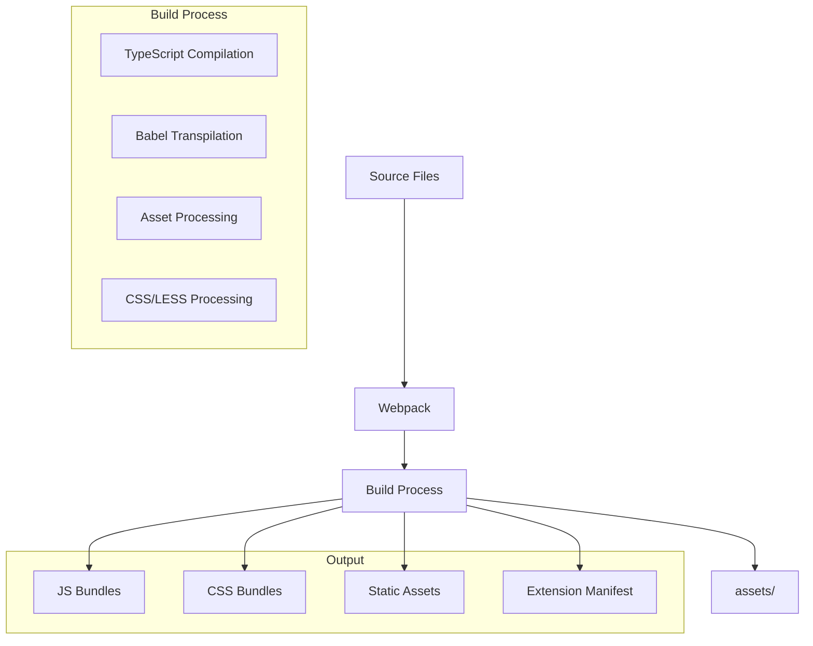

# Fabric Browser Extension

## Project Overview
The Fabric Browser Extension is a cryptocurrency wallet and identity management system that enables users to log in to Fabric applications securely. It's built as a browser extension using modern web technologies and cryptographic libraries.

**Do not fork** core `Key` / `Identity` in `src/types/`. Suite `types/` + `services/` map: `@fabric/core` `docs/TYPES_AND_SERVICES.md` (local `~/fabric-clean`).

## Core Features
- Identity Management
  - Create and manage multiple identities
  - Import/Export seed phrases
  - Chain-specific address derivation
- Secure Storage
  - AES-GCM encryption for sensitive data
  - Password-protected wallet access
  - LevelDB for local data persistence
- Chain Management
  - Enable/Disable specific chains per identity
  - Configurable chain settings
  - Multi-chain support
- Web Integration
  - Seamless login to Fabric applications
  - Browser extension popup interface
  - Developer console integration

## Technical Stack

### Frontend Framework
- React 18.2.0
- React Router DOM 6.30.0
- Semantic UI React 2.1.5 (UI components)
- TypeScript 5.3.3

### Cryptographic Libraries
- @bitcoinerlab/secp256k1 1.2.0
- bip32 5.0.0-rc.0 (HD wallet derivation)
- bip39 3.1.0 (Mnemonic seed phrases)
- SubtleCrypto (Browser's native crypto API)

### Build System


### Build Dependencies
- Webpack 5.90.3
  - webpack-cli 5.1.4
  - webpack-dev-server 4.15.1
- Babel
  - @babel/core 7.23.9
  - @babel/preset-react 7.23.3
  - @babel/preset-typescript 7.23.3
- Style Processing
  - sass 1.71.1
  - sass-loader 14.1.0
  - css-loader 6.10.0
  - semantic-ui-css 2.5.0

### Development Tools
- Mocha 11.1.0 (Testing)
- Playwright 1.52.0 (Browser Testing)
- c8 10.1.3 (Code Coverage)
- TypeScript 5.3.3
- Various Gulp plugins for Semantic UI building

## Project Structure
```
fabric-browser-extension/
├── src/                    # Source code
│   ├── background/         # Extension background scripts
│   ├── crypto/            # Cryptographic utilities
│   ├── services/          # Core services
│   ├── UIElements/        # React components
│   └── types/             # TypeScript definitions
├── assets/                # Built extension files
├── libraries/             # Third-party libraries
└── tests/                # Test files
```

## Build Process
1. TypeScript files are compiled and bundled using Webpack
2. React components are processed through Babel
3. Semantic UI themes are compiled using Gulp
4. Static assets are copied to the build directory
5. Source maps are generated for development builds
6. Final extension package is created in the assets directory

## Development Workflow
1. `npm run build:dev` - Development build with source maps
2. `npm start` - Start development server
3. `npm run build:prod` - Production build
4. `npm test` - Run test suite
5. `npm run coverage` - Generate test coverage reports

## Security Features
- Password-based encryption
- Secure key derivation
- Protected storage of sensitive data
- Chain-specific security settings